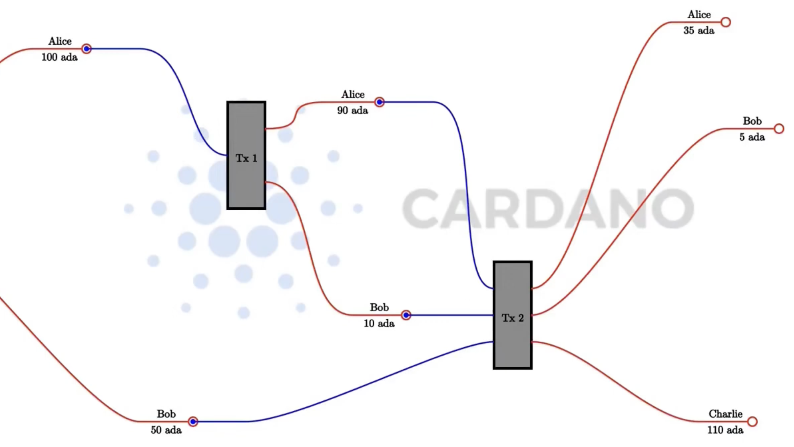

# Introduction

In this lecture, we're diving into the realm of Native tokens on Cardano and their interaction with Plutus. Specifically, we'll explore how to leverage Plutus for crafting minting policies that govern the conditions under which native tokens can be minted or burnt.

To lay the groundwork for understanding native tokens, it's essential to revisit the concept of "value" in Cardano. Recall our discussions on the extended UTXO model, where we outlined that each unspent transaction output (UTXO) on the Cardano blockchain is characterized by an address and a value. Additionally, with the advent of the extended UTXO model, a datum has also become an integral part of a UTXO, as illustrated through various examples in our previous lectures.

Up until now, our focus has predominantly been on Ada (or Lovelace as its smallest unit) when talking about "value" on the blockchain. It's crucial to note that Cardano initially only accommodates Ada (or Lovalace). The creation and elimination of native tokens necessitate explicit actions: they must be purposely minted when needed and similarly, burnt when they are no longer required. The forthcoming sections of this lecture will delve into the mechanisms of minting and burning native tokens and the role of Plutus in facilitating these processes.